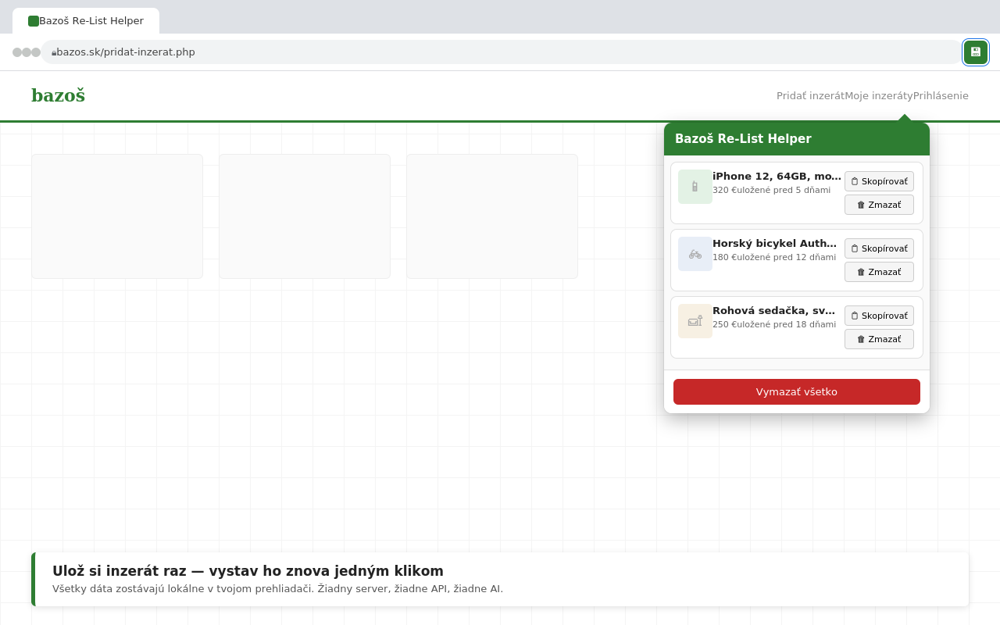

# Bazoš Re-List Helper

A free Chrome extension that helps sellers on [bazos.sk](https://bazos.sk) — the largest classifieds site in Slovakia — quickly re-post listings that have expired or that they want to publish again, without retyping everything from scratch.

Chrome Web Store: https://chromewebstore.google.com/detail/bazo%C5%A1-re-list-helper/jobmkbkoggbklekemkbddebmoancejeg

## The problem

Listings on bazos.sk automatically expire after a set period. Re-posting one means manually retyping the title, description, price, category, and location — every single time, for every listing. For sellers managing more than a handful of items, this becomes repetitive, tedious work.

## What it does

1. **Save** — while viewing your own live listing on bazos.sk, click "Uložiť na neskoršie znova-vystavenie" to save its data (title, description, price, category, location, image URLs).
2. **Re-list** — when you're ready to post again, open the "Pridať inzerát" form, open the extension popup, and pick the saved listing you want.
3. **Prefill** — the form fields are filled in automatically. You review everything and click Bazoš's own submit button yourself — the extension never submits anything on your behalf.

## Design principles

- **100% client-side.** No backend, no server, no external API calls of any kind.
- **No AI involved.** This is plain DOM scraping and form-filling — not generation. There's nothing to hallucinate.
- **Local-only storage.** All data lives in `chrome.storage.local`, on the user's own machine. Nothing is ever transmitted anywhere.
- **Minimal permissions.** The extension only requests `storage` and host access scoped to `*.bazos.sk` — not broad `<all_urls>` access.
- **Human stays in control.** The extension fills a form; it never auto-submits it. Every re-post is a deliberate, reviewed action by the user.

## Tech stack

Vanilla JavaScript, HTML, and CSS. No frameworks, no build step, no dependencies. Manifest V3.

## Project structure

    manifest.json              Extension manifest (Manifest V3)
    content-scripts/
      capture.js                Runs on live bazos.sk listing pages — scrapes and saves listing data
      prefill.js                Runs on the "Pridať inzerát" page — fills the form from saved data
    popup/
      popup.html / .js / .css   The extension's popup UI — browse, pick, and manage saved listings
    icons/                       Extension icons (16/48/128px)
    docs/privacy.html            Privacy policy (hosted via GitHub Pages)

## Running it locally

1. Clone this repo.
2. Go to `chrome://extensions` in Chrome.
3. Enable **Developer mode** (top right).
4. Click **Load unpacked** and select the project folder.
5. Visit bazos.sk and try it out.

## Known limitation

Images can't be re-uploaded automatically — browsers don't allow extensions to programmatically attach files to a file input for security reasons. Saved image URLs are shown for reference so they can be re-downloaded and re-uploaded manually.

## Privacy

Full privacy policy: [docs/privacy.html](docs/privacy.html].

In short: the extension collects no data beyond what the user explicitly saves from their own listings, stores it only locally in the browser, and never transmits it anywhere.

## License

MIT — see [LICENSE](LICENSE).

## Author

Nino Stanislav Cehelský — [ns-cehelsky.github.io/portfolio](https://ns-cehelsky.github.io/portfolio) · ns.cehelsky@gmail.com
